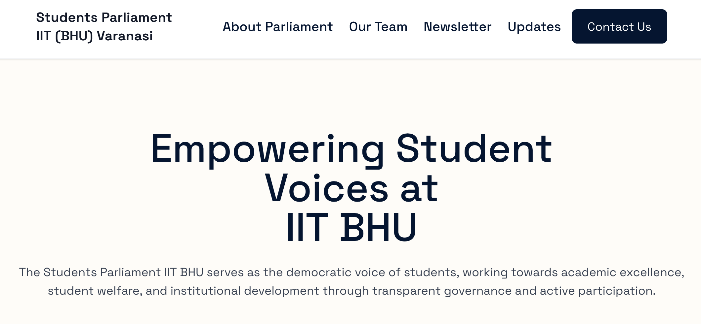

# Students' Parliament Website - IIT (BHU) Varanasi



This is the official website for the Students' Parliament of the Indian Institute of Technology (BHU), Varanasi. The platform is designed to be a central hub for information, updates, and communication, serving both the student body and the parliament members. It features a public-facing site for all students and a secure admin panel for content management.

## Table of Contents

- [Students' Parliament Website - IIT (BHU) Varanasi](#students-parliament-website---iit-bhu-varanasi)
  - [Table of Contents](#table-of-contents)
  - [Features](#features)
    - [Public Website](#public-website)
    - [Admin Panel](#admin-panel)
  - [Tech Stack](#tech-stack)
  - [Project Structure](#project-structure)
  - [Getting Started](#getting-started)
    - [Prerequisites](#prerequisites)
    - [Installation](#installation)
    - [Environment Variables](#environment-variables)
    - [Running Locally](#running-locally)
  - [Available Scripts](#available-scripts)
    - [Database Scripts](#database-scripts)
  - [Database Management](#database-management)
  - [Deployment](#deployment)

## Features

### Public Website

- **Homepage:** An engaging landing page introducing the Students' Parliament.
- **About Us:** Information about the mission, vision, and legacy of the Parliament.
- **Our Team:** Displays all parliament members, including the Executive Body and various committees.
- **Updates & Announcements:** A blog-style section for the latest news and announcements, with content rendered from Markdown.
- **Newsletters:** A dedicated section to browse and read official newsletters, with embedded PDF viewers.
- **Contact Page:** A comprehensive contact form that allows students to send messages directly to specific committees, along with general contact information.
- **Responsive Design:** Fully responsive layout for seamless viewing on all devices.

### Admin Panel

- **Secure Authentication:** Password-protected login for authorized administrators.
- **Dashboard:** An overview of key statistics like the number of updates, newsletters, and team members.
- **CRUD Operations for all Content:**
  - **Updates Management:** Create, read, update, and delete announcements and updates using a Markdown editor.
  - **Newsletters Management:** Add, edit, and delete newsletters, including titles, descriptions, and PDF embed codes.
  - **Team Management:** Add new parliament members, update their details (name, photo, contact), and remove them.
  - **Committee Management:** Create and manage committees, edit their descriptions, and assign members with specific roles (e.g., Member, Convenor).

## Tech Stack

- **Framework:** [Next.js](https://nextjs.org/) (v15) with App Router
- **Language:** [TypeScript](https://www.typescriptlang.org/)
- **Database:** [Turso](https://turso.tech/) (a distributed SQLite database)
- **ORM:** [Drizzle ORM](https://orm.drizzle.team/)
- **Styling:** [Tailwind CSS](https://tailwindcss.com/)
- **CMS:** Custom CMS built with Next.js server actions
- **UI Components:** [React](https://reactjs.org/), [React Icons](https://react-icons.github.io/react-icons/)
- **Markdown Rendering:** [Marked](https://marked.js.org/)
- **Linting/Formatting:** [ESLint](https://eslint.org/)
- **Deployment:** Vercel, Netlify, or any other Node.js hosting.

## Project Structure

The project follows the standard Next.js App Router structure.

```txt
sp-website/
├── public/                  # Static assets (images, fonts)
├── src/
│   ├── app/
│   │   ├── (main)/          # Routes for the public website
│   │   ├── admin/           # Routes for the admin panel (protected)
│   │   ├── login/           # Admin login page
│   │   └── layout.tsx       # Root layout
│   ├── components/          # Shared React components (Navbar, Footer, etc.)
│   ├── db/                  # Drizzle ORM schema, migrations, and db connection
│   ├── lib/                 # Utility functions, server actions, auth logic
│   └── middleware.ts        # Authentication middleware for admin routes
├── drizzle.config.ts        # Drizzle Kit configuration
├── next.config.ts           # Next.js configuration
└── package.json             # Project scripts and dependencies
```

## Getting Started

Follow these instructions to set up and run the project locally.

### Prerequisites

- [bun](https://bun.io/installation) (or npm/yarn)
- [Turso CLI](https://docs.turso.tech/cli/installation)

### Installation

1. **Clone the repository:**

    ```bash
    git clone https://github.com/your-username/sp-website.git
    cd sp-website
    ```

2. **Install dependencies:**

    ```bash
    bun install
    ```

### Environment Variables

Create a `.env.local` file in the root of the project by copying the example file:

```bash
cp .example.env .env.local
```

Now, fill in the variables in `.env.local` (not required, as example is prefilled with defaults):

```env
# Admin Panel Password (for login at /login)
ADMIN_PASSWORD="your_secure_password"

# JWT Secret for session encryption (generate a strong random string)
# You can use `openssl rand -base64 32` to generate one
AUTH_SECRET="your_strong_jwt_secret"

# -- Database Configuration --

# Local Turso URL (used by `bun run dev:db`)
TURSO_DB_LOCAL_URL="http://127.0.0.1:8080"

# (Optional) Remote Turso DB credentials for production-like testing
# Get these from your Turso dashboard
TURSO_DB_REMOTE_URL="your_turso_db_url"
TURSO_DB_APP_TOKEN="your_turso_auth_token"
```

### Running Locally

1. **Start the local database:**
    Open a new terminal and run the local Turso development server. This will create a `local.db` file in `src/db/`.

    ```bash
    bun run dev:db
    ```

2. **Run database migrations:**
    In another terminal, apply the database schema to your local database.

    ```bash
    bun run db:migrate
    ```

    *Alternatively, you can use `bun run db:push` for faster iteration during development, as it pushes schema changes without creating migration files.*

3. **Start the development server:**
    Finally, start the Next.js development server.

    ```bash
    bun run dev
    ```

The application should now be running at `http://localhost:3000`. The admin panel is available at `http://localhost:3000/admin`.

## Available Scripts

The `package.json` file contains several scripts for development and database management:

- `bun run dev`: Starts the Next.js dev server with Turbopack.
- `bun run build`: Builds the application for production.
- `bun run start`: Starts the production server.
- `bun run lint`: Lints the code using ESLint.
- `bun run dev:db`: Starts the local Turso database instance.

### Database Scripts

- `bun run db:generate`: Generates a new migration file based on schema changes.
- `bun run db:migrate`: Applies all pending migrations to the database.
- `bun run db:push`: Pushes schema changes directly to the DB without creating migration files (for development).
- `bun run db:studio`: Opens Drizzle Studio to view and manage your local database.
- **Production Scripts (`...:prod`)**: These scripts are configured to target the remote production database by setting the `DATABASE_ENV=production` variable. Use with caution.

## Database Management

The database schema is defined in `src/db/schema.ts` using Drizzle ORM. Whenever you change the schema, you must either generate a migration or push the changes to the database.

**Development Workflow:**

1. Modify the schema in `src/db/schema.ts`.
2. Run `bun run db:generate` to create a new SQL migration file in `src/db/migrations`.
3. Run `bun run db:migrate` to apply the migration.

You can view your local database at any time using Drizzle Studio:

```bash
bun run db:studio
```

## Deployment

This application is ready for deployment on platforms like Vercel or Netlify.

1. **Database:** Ensure you have a remote Turso database created.
2. **Environment Variables:** Set the following environment variables in your deployment platform's dashboard:
    - `ADMIN_PASSWORD`
    - `AUTH_SECRET`
    - `TURSO_DB_REMOTE_URL`
    - `TURSO_DB_APP_TOKEN`
    - `DATABASE_ENV` (set this to `production`)
3. **Build Command:** Your build command should be `bun run build` or `next build`.
4. **Run Migrations:** Before your application starts, you need to run the database migrations against your production database. Many platforms offer a pre-start hook or command. The command to use would be `bun run db:migrate:prod`.

---

*This project was developed with ❤️ by the [Club of Programmers (COPS)](https://www.copsiitbhu.co.in/) under [Science & Technology Council (SNTC), IIT (BHU) Varanasi](https://www.sntciitbhu.co.in/).*
